# Vue3.0项目-简易后台管理系统

教程官网：http://www.web-jshtml.cn/#/   视频地址：https://www.bilibili.com/video/BV1zJ411g7Fx  官方源码：[vue-admin](https://github.com/bigbigtime/vue-admin)

**学习内容**：Vue+Vuex+Router+ElementUi+Webpack全家桶，VUE3.0体验版API，组件化开发，生命周期，路由权限，Sass，Axios拦截器，缓存，项目部署，Nginx，域名，服务器，GIT，原型，接口联调，性能，缓存等；

**Vue学习**：VUECLI脚手架创建项目，ElementUI组件，VUE各项指令，Vuex、State、Getters、Mutations，component、props、propsData、computed，watch，cookie存储，sessionStorage存储、localStorage存储，路由守卫，检测Token 等等；

**学习成效**：完全自主搭建后台管理系统，理清系统整体流程，掌握公司级项目开发流程（由原型、UI、项目开发、后台联调、测试工程师、BUG修复、项目部署、项目迭代），VUE组件化思想开发（核心之一），真实业务接口联调，路由权限（角色分配、系统分配、按钮级权限），Nginx项目部署转发，业务逻辑抽离，API接口模块化，GIT代码管理（基本的git命令），模块系统增、删、改、查（信息功能、用户功能），七牛云第三方存储，HTML5本地储存；

------


## 第1课时

### 1.1 项目开发流程

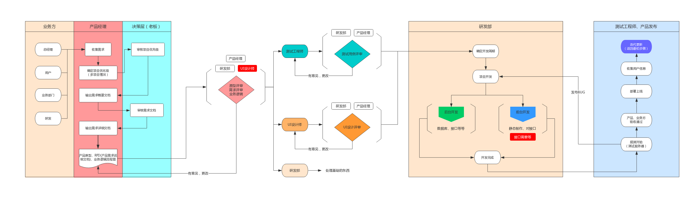

### 1.2 业务流程图

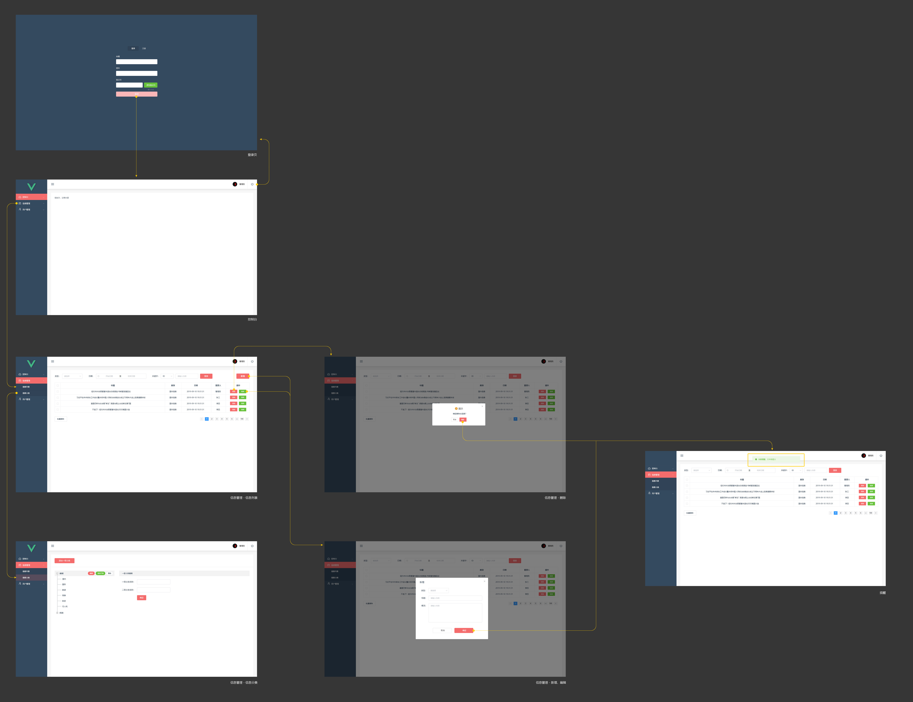

### 1.3 程序流程图

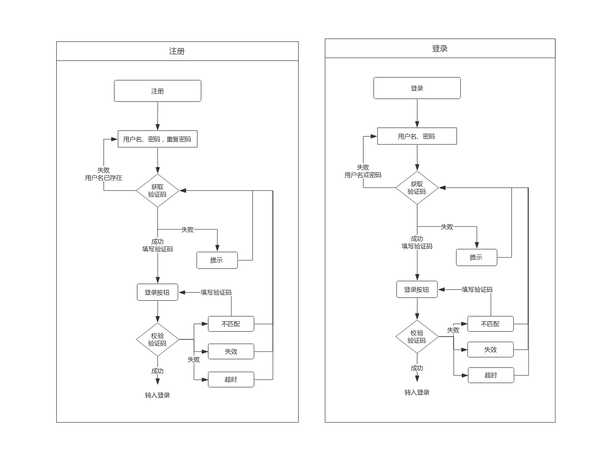

### 1.4 测试用例

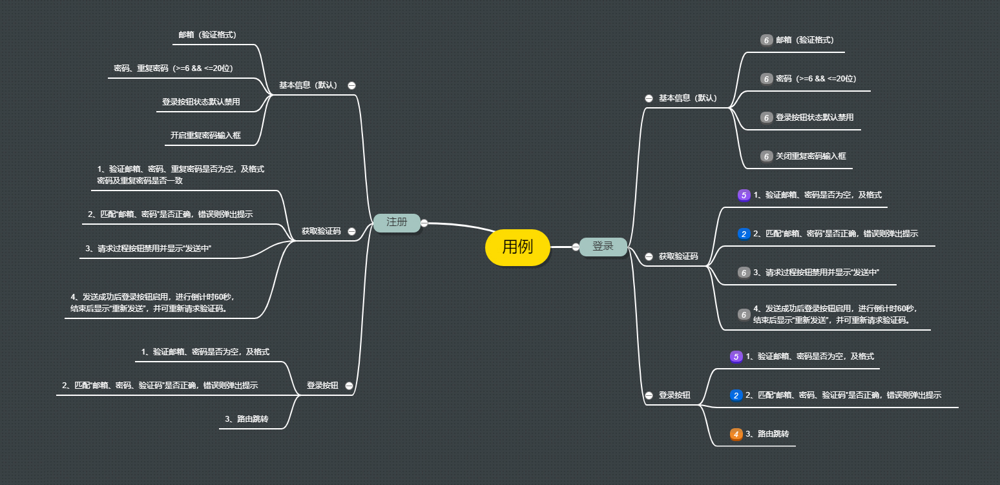

## 第2课时

### 2.1 环境安装

1. 安装**node.js**

https://nodejs.org/en/download/

查看版本号 node –v、npm –v 出现版本号即安装成功。（如未出现，请重启电脑后再试）node8.9或以上版本

2. 管理nodejs版本（非必装）

执行命令安装：npm install -g n

n latest (升级node.js到最新版)

n stable（升级node.js到最新稳定版）

n 后面也可以跟随版本号，例如：$ n v0.10.26 或者 $ n 0.10.26

3. 全局安装**vue-cli3.0脚手架**

卸载：如果已经全局安装了旧版本的vue-cli(1.x 或 2.x)，需要先卸载：npm uninstall vue-cli -g

安装：npm install -g @vue/cli

查看版本号：vue -V，出现版本号即安装成功。

3.0对2.0版本的桥接：npm install –g @vue/cli-init

### 2.2 建立项目仓库

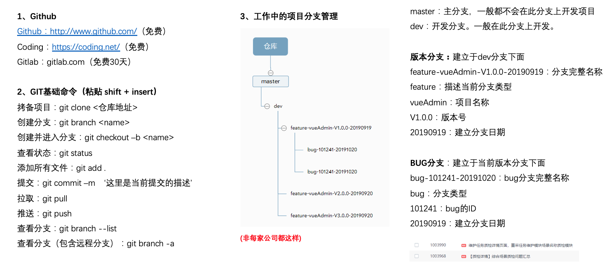

注意，可以使用git可视化管理工具[GitKraken](https://www.gitkraken.com) -  使用教程[1](https://www.cnblogs.com/brifuture/p/8823253.html)  [2](https://www.cnblogs.com/brifuture/p/8830797.html)  [3](https://www.cnblogs.com/brifuture/p/8869952.html)  [4](https://www.cnblogs.com/brifuture/p/8877048.html)  [5](https://www.cnblogs.com/brifuture/p/8947031.html)  [6](https://www.cnblogs.com/brifuture/p/8969526.html)  [7](https://www.cnblogs.com/brifuture/p/9009747.html)  [8](https://www.cnblogs.com/brifuture/p/9021362.html)  [9](https://www.cnblogs.com/brifuture/p/9052512.html)

### 2.3 构建项目

```shell
$ vue create vue-admin
```

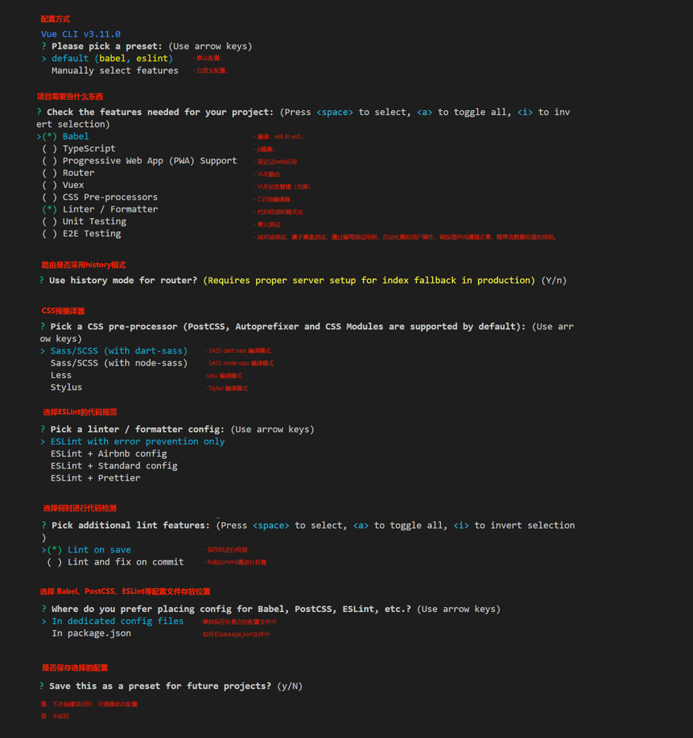

## 第3课时

### 3.1 Vue-cli

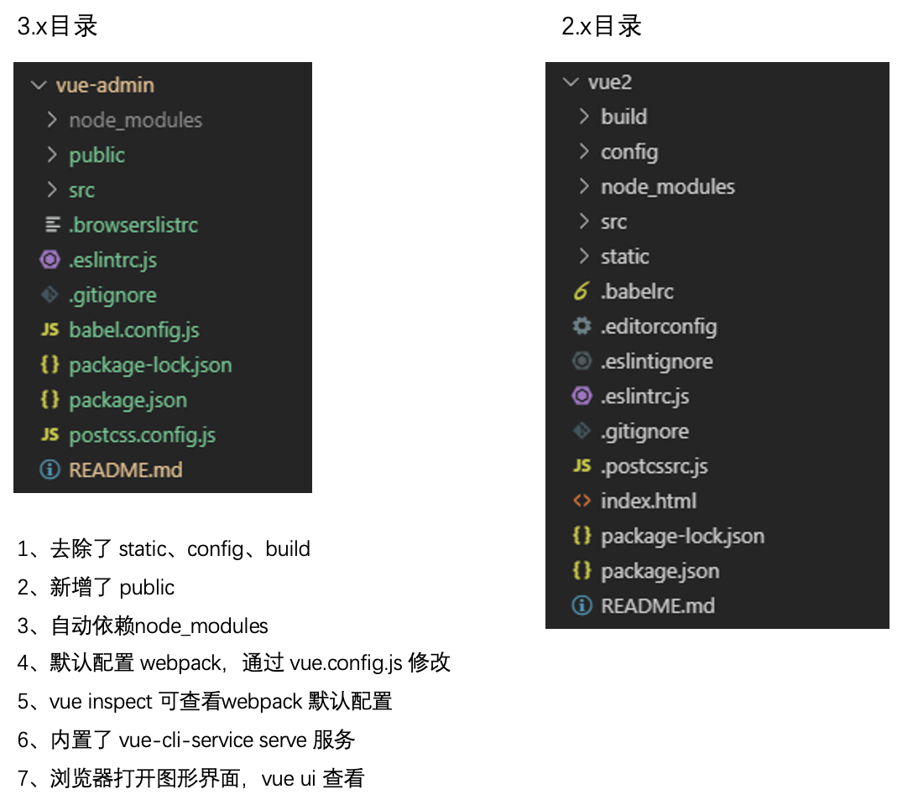

### 3.2 vue.config.js

> `vue.config.js` 是一个可选的配置文件，如果项目的 (和 `package.json` 同级的) 根目录中存在这个文件，那么它会被 `@vue/cli-service` 自动加载。你也可以使用 `package.json` 中的 `vue` 字段，但是注意这种写法需要你严格遵照 JSON 的格式来写。区别于vue2.0-cli中在webpack.config.js中进行配置。

```js
// vue.config.js
module.exports = {
  // 配置选项...
}
```

### 3.3 路由懒加载

> 路由懒加载指的是当路由被访问的时候才加载对应组件。

传统路由写法：

```js
import Home from "../views/Home.vue";
Vue.use([
  {
    path:'/',
    name:'Home',
    component: Home 
  }
]);
```

路由懒加载写法：

```js
Vue.use([
  {
    path:'/',
    name:'Home',
    component: ()=> import('../views/Home.vue')
  }
]);
```

### 3.4 路由重定向redirect

```js
// 从 /a 重定向到 /b
const router = new VueRouter({
  routes: [
    { path: '/a', redirect: '/b' }
  ]
})
// 重定向到名字为foo的组件
const router = new VueRouter({
  routes: [
    { path: '/a', redirect: { name: 'foo' }}
  ]
})
```

### 3.5 Element-UI

官网：[Element-UI](https://element.eleme.cn/#/zh-CN)

1. **安装依赖** - `npm i element-ui --S`
2. **全局引入**

```js
import ElementUI from 'element-ui'; 
import 'element-ui/lib/theme-chalk/index.css';
Vue.use(ElementUI);
```

## 第4课时

### 4.1 Vue文件规则


### 4.2 Vue基本指令

- **v-model**：在表单控件或者组件上创建双向绑定。
- **v-bind** **绑定属性**：绑定方式v-bind:attributeName 或 :attributeName
- **v-for**：基于源数据多次渲染元素或模板块，添加在循环出现的模版上而不是父元素

```vue
<div v-for=“(item, index) in items“ :key=“item.id”> 
    {{ item.text }} 
</div> 
```

- **v-show** / **v-if**
  - v-show：在元素中添加 display，隐藏DOM元素
  - v-if：直接删除DOM元素。DOM元素中有接口时，当v-if值为true时，会请求接口。

### 4.3 :class的绑定方式

详见 [官方文档-Class 与 Style 绑定](https://cn.vuejs.org/v2/guide/class-and-style.html)

1. 基本方法

```vue
<div v-bind:class="{ active: isActive }"></div>
<script>
    export default {
        data() {
            return {
                isActive: true
            }
        }
    }
</script>
```

2. 表达式

```vue
<div v-bind:class="{ active: isActive === -1 }"></div>
<script>
    export default {
        data() {
            return {
                isActive: 2
            }
        }
    }
</script>
```

3. 多个绑定

```vue
// 方法1 
<div v-bind:class="{ active: isActive, sort: isSort }"></div>
 <script>
    export default {
        data() {
            return {
                isActive: true,
                isSort: false
            }
        }
    }
</script>

// 方法2
<div v-bind:class="classObject"></div>
<script>
    export default {
        data() {
            return {
                classObject: {active:true,sort:false}
            }
        }
    }
</script>
```

4. 数组绑定 - **数组为具体的类名，而上面的对象通过true/false判断**

```vue
<div v-bind:class="[isActive, isSort]"></div>
<script>
    export default {
        data() {
            return {
                isActive: 'active',
                isSort: 'sort'
            }
        }
    }
</script>
```

5. 多种方式结合

```vue
<div v-bind:class="[{active: isActive}, isSort, isNew ? newClass : '']"></div>
<script>
    export default {
        data() {
            return {
                isActive: true,
                isNew: false
            }
        }
    }
</script>
```

## 第5课时

### 5.1 表单验证规则

- 验证邮箱：let reg = /^([a-zA-Z]|[0-9])(\w|\-)+@[a-zA-Z0-9]+\.([a-zA-Z]{2,4})$/
- 字母+数字：let reg = /^(?!\D+$)(?![^a-zA-Z]+$)\S{6,20}$/
- 字母或数字：left reg = /^[a-z0-9]{6}$/
- 特殊字符过滤

```js
function strFilter(s){
  const pattern = new RegExp("[`~!@#$^&*()=|{}':;,.<>/?！￥…（）—【】‘；：”“。，、？]");
  let re = '';
  for (let i = 0; i < s.length; i++) {
     rs = rs + s.substr(i, 1).replace(pattern, '');
  }
  return re;
}
```

## 第6课时

暂无。

## 第7课时

### 7.1 Composition API

Composition API详解：[https://vue-composition-api-rfc.netlify.com](https://vue-composition-api-rfc.netlify.com/)[/](https://vue-composition-api-rfc.netlify.com/)

```shell
$npm install @vue/composition-api --save
```

```js
// Main.js
import VueCompositionApi from '@vue/composition-api';
Vue.use(VueCompositionApi);
```

**Vue3.0新特性语法**

首先需要引入相关的

**1. setup函数**

> 按照官方给出的说法，setup函数是一个新的Vue组件选项，是用于在组件中使用Composition API的入口。

```js
export default {
  setup(props, context) {
    /* attrs: (...) == this.$attrs
      emit: (...) == this.$emit
      listeners: (...) == this.$listeners
      parent: (...) == this.$parent
      refs: (...) == this.$refs
      root: (...) == this */
    // ......
  }
}
```

特别要注意的在3.0语法中，ElementUI等已经不能直接用`this.???`之类的了，this要使用root来替换.

2. 声明对象**

> 在Vue2.0中为data(){ return {} }，而Vue3.0中使用recative()和ref()

- **Reactive**（声明单一对象时使用）

```js
const obj = reactive({count: 0})
// 获取值
console.log(obj.count) // 0
```

- **ref**（声明基础数据类型变量时使用）

```js
const number = ref(0);
// 获取值 .value
console.log(number.value) // 0
```

- **isRef**（检查一个对象是否是ref对象）

```js
const unwrapped = isRef(number) ? number.value : number;
```

- **toRefs**（toRefs将reactive对象转换为普通对象）

> 保证对象解构或拓展运算符不会丢失原有响应式对象的响应

```js
// 普通对象
const obj = {a: 1, b: 2}
let {a, b} = obj
console.log(a, b) // 1 2
// reactve对象
const reactiveObj = reactive({a: 1, b: 2})
let {a, b} = newObj // 1 2
const newObj = toRefs(reactiveObj)
let {a, b} = newObj
console.log(a, b) // RefImpl{} RefImpl{}
newObj.a // 无法获得
newObj.a.value // 1 - 需要添加value
```

**Composition API中生命周期函数**

```js
import { onMounted, onUpdated, onUnmounted } from 'vue'
const MyComponent = {
  setup() {
    onMounted(() => {
      console.log('mounted!')
    })
    onUpdated(() => {
      console.log('updated!')
    })
    onUnmounted(() => {
      console.log('unmounted!')
    })
  }
}
```


## 第8课时

### 8.1 axios拦截器

官网：[axios](http://www.axios-js.com)      安装 `npm install axios`

> 首先为了避免组件之间重复写接口，需要将接口脱离出来，形成单独的api文件引入即可。

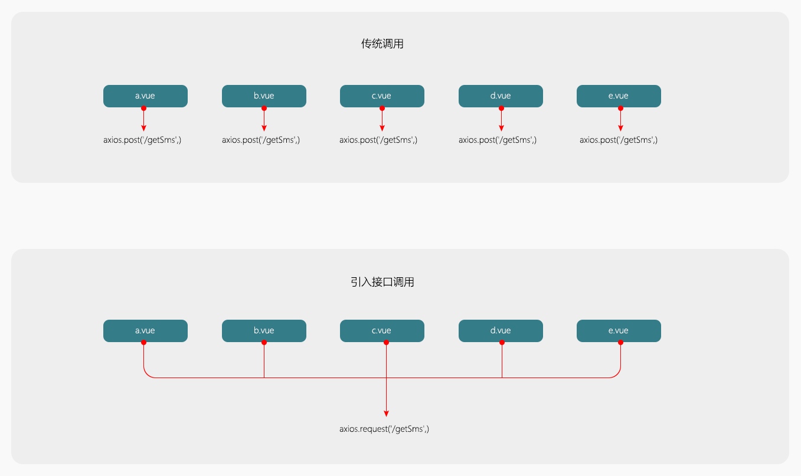

> 然后定义拦截器，在对应的api中引入拦截器进行处理。

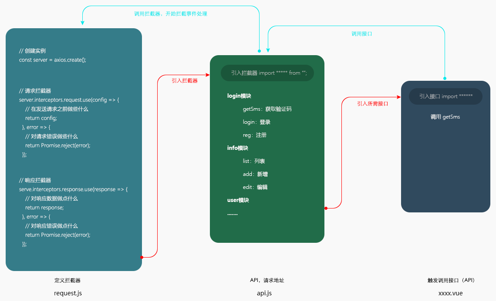

> 拦截器应用举例：

```js
// 添加请求拦截器
axios.interceptors.request.use(function (config) {
    // 在发送请求之前做些什么
    return config;
  }, function (error) {
    // 对请求错误做些什么
    return Promise.reject(error);
  });

// 添加响应拦截器
axios.interceptors.response.use(function (response) {
    // 对响应数据做点什么
    return response;
  }, function (error) {
    // 对响应错误做点什么
    return Promise.reject(error);
  });
```

一般会在请求拦截器中对请求添加一些参数：Tokey，userID......

### 8.2 模块引用

通过export default导出就不需要{}来import，但是这样只能导出一个函数；

```js
// file1.js
function service(){}
export default service;
// file2.js
import service from 'file1.js'
```

通过export导出时import需要{}，且可以导出多个函数；

```js
// file1.js
function service1(){}
function service2(){}
export {service1, service2};
// file2.js
import {service1, service2} from 'file1.js'
```

### 8.3 接口文档

详见：http://www.web-jshtml.cn/file/api.html

## 第9课时

### 9.1 环境变量与模式

默认情况下，一个 Vue CLI 项目有三个模式：

- `development` 模式用于开发环境
- `production` 模式用于生产环境（项目上线）
- `test` 模式用于测试

通过`process.env.NODE_ENV`的值development/production来知道此时处于何种环境下，并且根据当前的环境我们可以进行不同配置，举例如下：

```js
publicPath: process.env.NODE_ENV === 'production' ? '' : '/',  // 基本路径
outputDir: process.env.NODE_ENV === 'production' ? 'dist' : 'devdist', // 输出文件目录
```

我们也可以在项目根目录创建一个名为 `.env.development` 的文件，那么在这个文件里声明过的变量就只会在 development 模式下被载入，production同理。

**环境变量**：

- 以 `VUE_APP_` 开头 - 例如设置`VUE_APP_SECRET=secret`后，在构建过程中，`process.env.VUE_APP_SECRET` 将会被`secret`所取代。
- `NODE_ENV` - 会是 `"development"`、`"production"` 或 `"test"` 中的一个。
- `BASE_URL` - 会和 `vue.config.js` 中的 `publicPath` 选项相符，即你的应用会部署到的基础路径。

### 9.2 跨域设置

1. 本地`http://192.168.1.106:8080`调用`/getSms`接口则对应的URL为`http://192.168.1.106:8080/getSms/`
2. baseURL设置 - 相当于在访问的借口前加了一个前缀
- 如果axios的baseURL设置为`http://192.168.1.1`，则此时对应的URL为`http://192.168.1.1/getSms/`

```
const service = axios.create({
    baseURL: 'http://192.168.1.1',
    timeout: 1000, // 超时
})
```

- 如果axios的baseURL设置为`/api`，则此时对应的URL为`http://192.168.1.106:8080/api/getSms/`

```
const service = axios.create({
    baseURL: '/api',
    timeout: 1000, // 超时
})
```

3. 在vue.config.js中进行跨域配置 - 当访问域名时遇到/api，则讲前面的域名转换为target，即原本`http://192.168.1.106:8080/api/getSms/`变成了`http://www.web-jshtml.cn/productapi/api/getSms/`，此时我们不需要`/api`则借助pathRewrite将其转为空，最终访问urk为`http://www.web-jshtml.cn/productapi/getSms/`

```js
proxy: { 
    '/api': {
        target: 'http://www.web-jshtml.cn/productapi', // 服务地址
        changeOrigin: true,
        pathRewrite: {
            '^/api': ''
        }
    }
}
```

## 第10课时

暂无

## 第11课时

### 11.1 setTimeout/setInterval

> 需求：验证码按钮在请求过程中禁用并显示“发送中”，在请求成功后，倒计时60s结束后显示“重新发送”。

通过setTimeout/setInterval来实现，但是要注意，setTimeout/setInterval在使用过程中要注意清除！！！

- setTimeout:clearTimeout(变量)  只执行一次
- setInterval:clearInterval(变量) 不断的执行，需要条件才会停止

## 第12课时

### 12.1 promise对象

> 主要了解四个内容，resolve，reject，all，race。

- 普通语法

```js
let promise = new Promise((resolve, reject) => {
    // ...
})
promise.then(response => {
    console.log('成功')
    console.log(response)
}).catch(error => {
    console.log('失败')
    console.log(error)
})
```

- all方法 - 数组内promise全部成功(resolve)，才执行then，只要有一个返回(reject)不成功，就执行catch。

```js
Promise.all([promise1(true), promise2(true), promise3(true)]).then(response => {
    console.log('全部调用成功');
}).catch(error => {
    console.log('有些可能失败了');
})
```

- race方法 - 竞速，只有有一个率先改变状态，最终的状态就跟着改变。

```js
Promise.race([promise1(false), promise2(true), promise3(true)]).then(response => {
    console.log('成功');
}).catch(error => {
    console.log('失败了');
})
```

## 第13课时

### 13.1 密码sha1加密

安装完js-sha1后，`import sha1 from 'js-sha1'`导入，然后直接使用`sha1()`即可。

```shell
$npm install js-sha1
```

密码加密的流程：

1. 在前端预先加密一次
   1. 登录的密码：123456（普通字符串）
   2. 经过加密后：sha1('123456') == '541216ad5s4f5ds1f5asd4f65asd4' （加密后的字符串）
2. 后台加密
   1. 接收到字符串：'541216ad5s4f5ds1f5asd4f65asd4'
   2. 后台再次加密：md5('541216ad5s4f5ds1f5asd4f65asd4') == '8f9qwersd3g165y4d1sf3s1f6aew4'（最终的加密后的密码）
3. 登录 - 用户名与加密后的密码进行匹配，成功则登录，失败则提示

## 第14课时

暂无。

## 第15课时

### 15.1 Router路由

1. 在HTML中以a标签形式跳转 - 在template中设置`<router-link>`即可

```vue
<!-- 不带参数跳转 -->
<router-link :to="{name:'index'}">跳转链接1</router-link>
<router-link :to="{path:'/index'}">跳转链接2</router-link>
<!-- 带参数跳转 -->
<router-link :to="{name:'index',params:{id:1}}">跳转链接3</router-link>
<router-link :to="{name:'index',query:{id:1}}">跳转链接3</router-link>
```

2. 在JS中设置进行跳转 - 在函数中调用`this.$router.push()`即可

```js
// 不带参数跳转
this.$router.push('/home');
this.$router.push({name:'home'});
this.$router.push({path:'/home'});
// 带参数跳转
this.$router.push({name:'home',query: {id:'1'}}) 
this.$router.push({path:'/home',query: {id:'1'}}) // 参数接收：this.$route.query.xxxxxxx
this.$router.push({name:'home',params: {id:'1'}}) // 参数接收：this.$route.params.xxxxxxx
```

**⚠️传参区别**

- query跳转配合路由 path 属性，传参为明文，url上参数可见，刷新后参数不会消失
- Params路转配合路由 name 属性，传参为密文，url上参数不可见，刷新后参数会消失

注意，通过Params传参的话，路由配置 path: "/home/:id" 或者 path: "/home:id" 刷新页面id会保留,不配置path ,刷新页面参数会消失。

其他请参看[22.1 路由传参和接收方式](#221 路由传参和接收方式)

### 15.2 二级路由

路由配置如下：

```js
path: '/home',
name: 'Home',
component: () => import('../views/Layout/index'),
children: [
    {
        path: '/home',
        name:'home',
        component:() => import('../views/home/index')
    },
  	{
        path: '/home/user',
        name:'user',
        component:() => import('../views/user/index')
    }
]
```

解释说明：

当访问地址`/home`时，加载`../views/Layout/index`组件进行显示，此时该组件中仍旧嵌套了路由`<router-view/>`，则该部分就加载`'../views/home/index'`组件进行显示；当访问地址`/home/user`时加载`../views/Layout/index`组件进行显示，但是该组件中的路由部分则加载`'../views/user/index'`来显示了。

总结：

- 访问`/home` - `../views/Layout/index`组件 + 路由部分`'../views/home/index'`组件
- 访问`/home/user` - `../views/Layout/index`组件 + 路由部分`'../views/user/index'`组件

## 第16课时

### 16.1局部样式与全局样式

```vue
<style lang='scss' scoped></style>
```

在vue文件的样式中，如果设置了scoped则表示当前的样式仅在该vue文件中生效；如果没有设置scoped则表示为全局样式。

### 16.2 路由菜单

路由菜单可通过router.js文件来设置，`this.$router.options.routes`获取路由信息，通过遍历即可获取对应的信息，举例如下：

```js
const routes = [
    {
        path: '/login',
        name: 'Login',
        hidden: true,
        component: () => import('../views/Login/index'),
        meta: {
            name: '登录'
        }
    },
    {
        path: '/user',
        name: 'User',
        component: () => import('../views/Layout/index'),
        meta: {
            name: '用户管理'
        },
        children: [
            {
                path: "/userIndex",
                component: () => import('../views/User/index'),
                meta: {
                    name: '用户列表'
                }
            }
        ]
    }
]
```

借用elementUI来实现导航菜单：

```vue
<el-menu  background-color="transparent" text-color="#fff" active-text-color="#fff" router>
    <template v-for="(item,index) in routers">
        <el-submenu v-if='!item.hidden' :key='index' :index="item.path">
            <!-- 一级菜单 -->
            <template slot="title">
                <i class="el-icon-location"></i>
                <span>{{item.meta.name}}</span>
            </template>
            <!-- 子级菜单-->
            <el-menu-item v-for='(subItem,index2) in item.children' :key="index2" :index="subItem.path">{{subItem.meta.name}}</el-menu-item>
        </el-submenu>
    </template>
</el-menu>
```

说明1：通过`this.$router.options.routes`获取routes，如果该路由不需要生成菜单可自定义属性进行判断，例如上述采用hidden属性来判断，另外可通过childen来获取下一层的路由信息，生成二级导航菜单。

说明2：一般我们避免v-for和v-if同时使用，上述采用的解决方法是v-for里嵌套v-if，只需要把v-for写在template上即可；除此之外，还可以v-if里嵌套v-for。

## 第17课时

### 17.1 SVG文件

1. 自定义全局组件SvgIcon在`main.js`注册，见[17.2 全局组件 Vue.component](#172 全局组件 Vuecomponent)
2. 组件模版添加

```vue
<svg :class="svgClass" aria-hidden="true">
   <use :xlink:href="name"></use>
</svg>
```

3. 解析svg文件

```
const req = require.context('./svg', false, /\.svg$/)
const requireAll = requireContext => {
  return requireContext.keys().map(requireContext)
}
requireAll(req)
```

4. Vue.config.json中配置

```js
module.exports = {	
	chainWebpack: (config) => {
        const svgRule = config.module.rule("svg");
        svgRule.uses.clear();
        svgRule
            .use("svg-sprite-loader")
            .loader("svg-sprite-loader")
            .options({
                symbolId: "icon-[name]",
                include: ["./src/components/icons"]
            });
    }
}
```

注意，需要安装依赖：

```shell
$npm install svg-sprite-loader -S
```

svg文件更改颜色，不能通过color属性来设置，而是使用fill属性：

```css
.svg-icon{
  fill: #fff;
}

/* 或者也可指定使用当前的颜色 */
.svg-icon{
  fill: currentColor;
}
```

### 17.2 全局组件 Vue.component

规则：`Vue.component(‘组件名称’， ‘组件代码’)` —— 组件代码即我们使用vue文件写的那些代码

在vue3.0中有两种模式：

- compiler（模板）模式
- runtime模式 —— vue模块的默认为runtime模式， 指向了"dist/vue.runtime.common.js"位置

```js
// compiler（模式）模板
new Vue({
  el: '#app',
  router: router,
  store: store,
  template: '<App/>',
  components: { App }
})
// runtime模式（运行时） 
new Vue({
  router,
  store,
  render: h => h(App)
}).$mount("#app")
```

我们在vue3.0中要使用全局组件的话就需要在config.js里修改vue的默认指向，也就是改为compiler模式 - [参考链接](https://www.cnblogs.com/maizilili/p/12624964.html)：

```js
module.exports = {
   configureWebpack: (config) => {
        config.resolve = { // 配置解析别名
           alias: {
             'vue': 'vue/dist/vue.esm.js',
           }
        }
   }
}
```

### 17.3 prop/propsData

props 可以是基础数据或对象，用于接收来自父组件的数据。父组件中使用子组件直接以`参数名=参数值`的形式传递即可，在子组件中使用props获取。

```vue
// 父组件传递参数
<template>
	<div>
    <child myParams='hello'></child>
  </div>
</template>

// 子组件接受参数
<template>
	{{myParams}}
</template>
<script>
  export default{
   	props:['myParams'],
    setup(props){
      // 此时props也注入进来，可以直接打印
      console.log(props.myParams)
    }
  }
</script>
```

接收Props参数分为两种写法：

```js
// 普通写法就直接参数名字的数组
props: [‘iconClass’, ‘className’] //不限制数据类型

// 规定数据类型写法
props: {
  iconClass: {
    type: String,
    required: true
  },
  className: {
    type: Array,
    default: () => [],
    validator: (value) => {
       return value >= 0;
    }  
  }
}
```

规定数据类型的参数说明：

- type（规定数据类型 ）：String：字符串；Number：数字；Boolean：布尔；Array：数组；Object：对象；Date：日期；Function：函数；Symbol：示独一无二的值（ES6）。
- required（必填项）：默认为false，如果设为true，则父级必须传入数据，否则会报错。
- default（默认值）：基础数据类型：直接赋值；对象数据类型：用函数赋值 () => []
- validator（验证传入的值是否符合规则）：校验

### 17.4 watct/computed

**computed (计算属性)**

```js
// 2.0 - 普通写法
computed:{
  iconName(){ return this.name + 'icon' }
}
// 2.0 - get/set写法
computed:{
  iconName:{
    get(){ return this.name + 'icon' }
    set(){ this.name = 'newIcon' } 
  }
}

const count = ref(1)
// 3.0 - 普通写法
const plusOne = computed(() => count.value + 1)
// 3.0 - get/set写法
const plusOne = computed({
  get: () => count.value + 1,
  set: val => { count.value = val - 1 }
})
// 举例
plusOne.value = 2 
console.log(count.value) // 1，上面set设置 count.value 为 1
console.log(plusOne.value) // 2，此时count.value 为 1，+1即为2
```

**watch (观察值变化)**

两种监听方式：

- deep：深度监听，无论数据被嵌套多深
- immediate：初始监听（简单理解，组件被加载时就监听）

```js
// 2.0写法
wacth: {
  myData: {
    handler(newValue, oldValue){
      console.log(newValue)
    },
    deep: true,
    immediate: true
  }
}
// 3.0写法
// 基础数据
watch(myData, (val)=>{
    console.log(val)
})
// 对象数据
watch(() => chooseItems.value, (val) => { console.log(val) })
// 多个监听
watch([
  () => cons.page, 
  () => cons.pageSize, 
  () => query.value
], ([val1, val2, val3]) => {
  console.log(val1, val2, val3)
})
```

### 17.5 头像 - 图片居中裁剪

```html

<style>
  img{
    width:100px;
    height:100px;
    border-radius:100px;
    object-fit: cover;
  }
</style>
```

关键在于object-fit 属性指定元素的内容应该如何去适应指定容器的高度与宽度：

- fill - 默认，不保证保持原有的比例，内容拉伸填满整个内容容器
- contain - 保持原有尺寸比例，内容被缩放（显示全部，多余部分会留白）
- cover - 保持原有尺寸比例，但部分内容可能被剪切（显示部分，多余部分会裁剪）

## 第18课时

### 18.1 Vuex状态管理

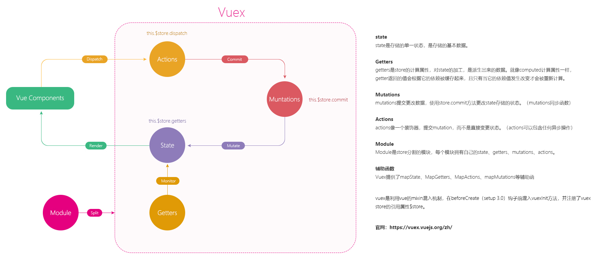

**5个部分**

**1. state**  —— 储存初始化数据 this.$store.state.xxxxx 

**2. getters** —— 对State里面的数据二次处理（对数据进行过滤类似filter的作用）this.$store.getters.xxx

**3. mutations** —— 对数据进行计算的方法全部写在里面，在页面中触发时使用 this.$store.commit('mutationName')

**4. modules** —— 模块化Vuex

**5. actions** （异步）—— action的功能和mutation是类似的，都是去变更store里的state，不过action和mutation有两点不同：

- action主要处理的是异步的操作，mutation必须同步执行，而action就不受这样的限制，也就是说action中我们既可以处理同步（视图触发Action，Action再触发Mutation），也可以处理异步的操作

- action改变状态，最后是通过提交mutation，this.$store.dispatch(actionName)

- 角色定位基于流程顺序，二者扮演不同的角色。Mutation：专注于修改State，理论上是修改State的唯一途径。Action：业务代码、异步请求。

**模块化** - 参考资料:[Vuex 模块化使用](https://segmentfault.com/a/1190000019924674)

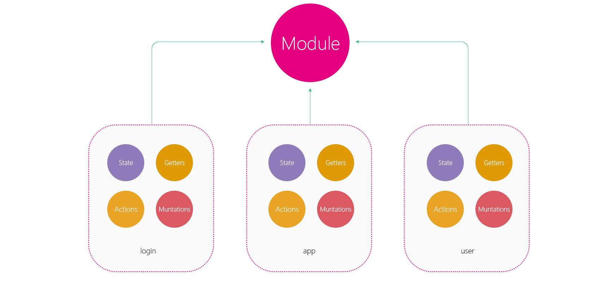

```js
export default new Vuex.Store({
  modules:{
    login,
    info,
    user
  }
})

// 模块化后使用可以添加模块名
this.$store.state.moduleA.name;
// getter，mutation，action 他们默认都是注册在全局命名空间的，我们可以模块导出的时候加个 namespaced: true 使其成为带命名空间的模块，然后就可以通过模块名访问了，具体详见参考资料
this.$store.getters['moduleA/fullName']; 
this.$store.dispatch('moduleA/ASYNC_SET_NAME', { name: "JJ" }); 
```

### 18.2 浏览器存储

**1. cookie_js**

```shell
$npm install cookie_js --save
```

```js
// 储存
cookie.set('key', 'value');
cookie.set({ key1: 'value1', key2: 'value2' });

// 获取
cookie.get('key');
cookie.get(['key1', 'key2']);

// 清除
cookie.remove('key'); 
cookie.remove('key1', 'key2'); 
cookie.remove(['key1', 'key2']);
```

**2. HTML5本储存**

- sessionStorage(关闭浏览器时即清除) 临时性

>存储大小：5M（数据量大小）；存储于客户端；只能存储字符串类型；主要存储一些比较简单的东西，或是小的交互；

```js
// 存储
window.sessionStorage.setItem("key","value");
// 获取
window.sessionStorage.getItem("key");
// 删除
window.sessionStorage.removeItem("key");
// 清空所有
sessionStorage.clear();
```

注意：在存取的时候需要对象和字符串进行转换，JOSN.parse() 字符串转为对象 + JSON.stringify() 对象转为字符串。

- localStorage(手动清除) 长期性；

```js
// 存储
window.localStorage.setItem("key","value");
// 获取
window.localStorage.getItem("key");
// 删除
window.localStorage.removeItem("key");
// 清空所有
localStorage.clear();
```

## 第19课时

### 19.1 守卫路由

> 常见用途：用户进入首页，如果未登录则自动跳转至登录页面。

```js
router.beforeEach((to, from, next) => {
   /**
    * to: 进入的页面
    * from: 上一个页面
    * next: 跳转页面
    */
})
```

注意：一定确保要调用 next 方法（也就是写了next方法），否则钩子就不会被 resolved，可能会陷入死循环。

- next()：参数为空，即执行了to里面的路由对象，且跳转不会再执行beforeEach，带参数的next跳转会再次触发beforeEach

- next('/')或者next({ path: '/' })：跳转到一个不同的地址。当前的导航被中断，然后进行一个新的导航。你可以向 next 传递任意位置对象，且允许设置诸如 replace: true、name: 'home' 之类的选项以及任何用在 router-link 的 toprop 或 router.push 中的选项。
- next(error)：如果传入 next 的参数是一个 Error 实例，则导航会被终止且该错误会被传递给 router.onError() 注册过的回调。

**Token登录检测举例**

```js
/**
 * 1、直接进入非白名单路径如index的时候，参数to被改变成了 "/index"，触发路由指向，就会跑beforeEach
 * 2、若token不存在，且不在白名单中，next 指向了login，再次发生路由指向，再跑beforeEach，参数的to被改变成了"/login"
 * 3、白名单判断存在，则直接执行next()，因为没有参数，所以不会再次beforeEach。
 */

const whiteRouter = ['/login']; // 设置白名单
router.beforeEach((to, from, next) => {
    if (getToken()) {
        // token 存在
        next()
    } else {
        // token不存在 - 跳转登录页面
        if (whiteRouter.indexOf(to.path) !== -1) {
            next()
        } else {
            next('/login')
        }
    }
})
```

### 19.2 Token登录检测

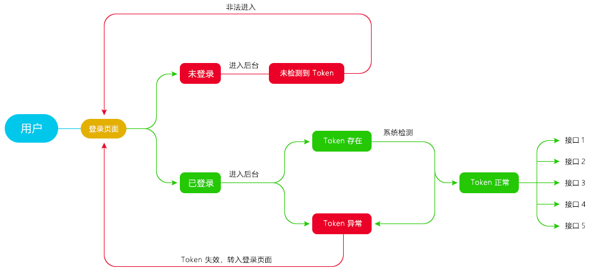

## 第20课时

### 20.1 回调$emit与修饰符sync

子组件通过`vm.$emit(eventName,arg)`传递信息给父组件，而父组件上通过`<child @eventName=""></child>`监听事件来接受。修饰符sync为语法糖：子组件传递`this.$emit('update:foo', newValue)`，父组件原本写法`<child :foo="bar" @update:foo="val => bar = val"></child>`，现在可以通过sync语法糖简写`<child :foo.sync="bar"></child>`即可。vue 修饰符sync的功能是：当一个子组件改变了一个 prop 的值时，这个变化也会同步到父组件中所绑定。

```vue
// 子组件
<template>
    <div>
         我是一个子组件，我在红色的海洋里！
        <input type="button" value="点我隐身" @click="upIsShow">
    </div>
</template>
<script>
    export default {
        methods:{
            upIsShow(){
                this.$emit("update:isShow",false);
            }
        }
    }
</script>
```

```vue
// 父组件
<template>
    <div>
        <input type="button"
               value="我是父组件中的按钮"
               @click="show">
      	<child :isShow.sync="isShow" v-show="isShow"/>
    </div>
</template>
<script>
    import child from "@/components/child"
    export default {
        data() {
            return {
                isShow:false
            }
        },
        components:{
            child
        },
        methods:{
            show(){
                this.isShow=true;
            },
            changeIsShow(bol){
                this.isShow=bol;
            }
        }
    }
</script>
```

一步步简写过程：

- `<child @update:isShow="function(bol){isShow=bol}" v-show="isShow"/>`
- `<child @update:isShow="bol=>isShow=bol" v-show="isShow"/>`
- `<child :isShow.sync="isShow" v-show="isShow"/>`

### 20.1 全局方法

> 全局方法有助于节约代码资源，不用重复写很多一致的代码或仅部分不同的代码。

**1. 全局注册**

```js
// 1.自定义文件toTop.js中创建方法
export default {
  install (Vue, options) {
    Vue.prototype.$toTop = function () {
      console.log('Plugin Test')
    }
  }
}
// 2.在main.js中添加到全局方法
import ToTop from './toTop'
Vue.use(ToTop)
// 3. 全局均可使用
this.$toTop()
```

**2. 按需引入**

```js
// 1.自定义文件toTop.js中创建方法
export function toTop() {
  console.log('Plugin Test')
}
// 2.使用的文件中按需引入
import {toTop} from './toTop'
// 3.引入后才可使用
toTop()
```

**3. VUE3.0方法**

```js
// 1.自定义文件中创建方法
export function myGlobal(){
	const func1 = ()=>{}
  const func2 = ()=>{}
  return {func1, func2}
}
// 2.使用的文件中引入
import myGlobal from './global.js'
setup(){
  const {func1,func2} = myGlobal()
  // 下面即可使用func1和func2了
  func1();
}
```

## 第21课时

略。

## 第22课时

### 22.1 路由传参和接收方式

**第一种：明文传参**

> URL路径会显示传递的参数。优势：页面刷新参数不会丢失，劣势：参数公开。

```js
// Html跳转
<router-link :to="{name:xxx,query:{}}"></router-link>

// JS跳转
this.$router.push({
  name: `xxx`,
  query: {
  }
})

// 跳转页面接收参数
this.$route.query.xxxxxx
```

**第二种：密文传参**

>URL路径不会显示传递的参数。优势：参数不显示，劣势：页面刷新参数消失。

```js
// Html跳转
<router-link :to="{name:xxx,params:{}}"></router-link>

// JS跳转
this.$router.push({
  name: `xxx`,
  params: {
  }
})

// 跳转页面接收参数
this.$route.params.xxxxxx
```

**第三种：冒号形式传参**

> 优势：页面刷新参数不会丢失，劣势：需要一一配置。

```js
// 路由配置
{
  path: "/infoDetailed/:newsId/:newsTitle",
  name: "InfoDetailed”
  meta: {
    name: "信息详情"
  },
  component: () => import("../views/Info/category.vue")
}

// JS跳转
root.$router.push({
    path: `/InfoDetailed/${data.id}/${data.title}`
})

// 跳转页面接收参数
$route.params.newsId
$route.params.newsTitle
```

**第四种：vuex 结合 HTML5本地储存**

> 优势：参数不显示，劣势：微稍有点大材小用（解决第二种传参参数丢失）

**第五种：新窗口打开**

> 很少见。优势：参数不显示，劣势：微稍有点大材小用（解决第二种传参参数丢失）

```js
// Html跳转 - vue1不支持，query/params均可
<router-link tag="a" target="_blank" :to="{name:'searchGoods',params:{}}">热门好货</router-link>


// JS跳转 - 注意函数是resolve，不是push
let routeData = this.$router.resolve({
   name: "searchGoods",
   query: params,
   // params:{}
});
window.open(routeData.href, '_blank')
```

### 22.2 富文本编辑器

> 选择第三方富文本编辑器安装即可，以下为一种例子 - https://www.npmjs.com/package/vue-quill-editor

安装：

```shell
$npm install vue-quill-editor --save
```

引入

```js
import { quillEditor } from "vue-quill-editor";
import 'quill/dist/quill.core.css';
import 'quill/dist/quill.snow.css';
import 'quill/dist/quill.bubble.css';
```

使用

```vue
<quillEditor v-model="form.content" ref="myQuillEditor" :options="data.editorOption"/>
```

## 第23课时

### 23.1 组件化

>页面开发中的**组件**其实就是页面组成的一部分，就像电脑中的每一个元件（如硬盘、键盘、鼠标），它是一个具有独立的逻辑和功能或界面，同时又能根据规定的接口规则进行相互融合，变成一个完整的应用。更简单的理解就是，将页面的业务逻辑拆分各个小块，再重新的组合起来，形成一个完整的体系。当不需要某个组件，或者想要替换某个组件时，可以随时进行替换和删除，而不影响整个应用的运行。

**1. 为什么要组件化开发、优势是什么？**

**高内聚性：**组件功能必须是完整的，如我要实现下拉菜单功能，那么在下拉菜单这个组件中，就只做下拉菜单所需要的所有功能。

**低耦合度：**代码独立不会和项目中的其他代码发生冲突。

说的简单点就是，在实际工程中，常会涉及到团队协作（多人共同开发）。以传统的方式开发业务线去编写代码的方式，就很容易相互冲突，因为大家都可能在同一个文件中做事。所以用组件化方式开发就可避免这种冲突，因为每个人负责着不同的组件开发，所以都不会有改到别人代码的事情发生，并且每一个组件都有清晰的职责，完整的功能，各管各的功能，便于单元测试和重复利用。

**优势：**

1. 提高开发效率：当开发好一个组件后，如果其他地方功能是一样的，直接载入组件即可，方便又快；
2. 方便重复使用：一次开发，多处使用；
3. 简化调试步骤：只调试当前组件，与其他业务逻辑无关。很多页面用了相同组件后，如果组件有BUG，那么所以引用的都有BUG，一个修复，即全部修复；
4. 提升整个项目的可维护性：组件独立维护，管理性强；维护时对其他业务逻辑没有影响；
5. 便于多人协同开发：多人开发，各人负责自己的所开发的组件，不会修改到其他人的代码；避免代码误改问题；

**2. 组件类型**

1. 页面级别的组件：页面级别的组件，通常是views目录下的.vue组件，是组成整个项目的一个大的页面。一般不会有对外的接口。
2. 业务上可复用的基础组件：在业务中被各个页面复用的组件，这一类组件通常都写到components目录下，然后通过import在各个页面中使用。
3. 与业务无关的独立组件：与业务功能无关的独立组件。这类组件通常是作为基础组件，在各个业务组件或者页面组件中被使用。目前市面上比较流行的ElementUI和iview等中包含的组件都是独立组件。如果是自己定义的独立组件，比如富文本编辑器等，通常写在utils目录中。

**3. 组件三要素：**

1. Prop：用于定义组件的属性（组件属性参数）。
2. Event：自定义事件用于触发组件的事件（经常会回调父组件方法）。
3. Slot：用于组件功能的扩展。（插槽），父组件的内容传入子组件，在子组件中显示

**4. 定义组件**

```js
// 全局组件
// 注册的全局组件，在vue项目中.vue页面都会挂载此组件，有点资源浪费
Vue.component('child-component', {
    template: `
    <div>
        <slot>
            <p>如果父组件没用插入内容,我将作为默认出现</p>
        </slot>
    </div>`
});

// 局部组件
// 按需加载，只在有需要的.vue页面中引用，不浪费资源，就是有点麻烦
import Users from './components/Users‘
```

### 23.2 生命周期

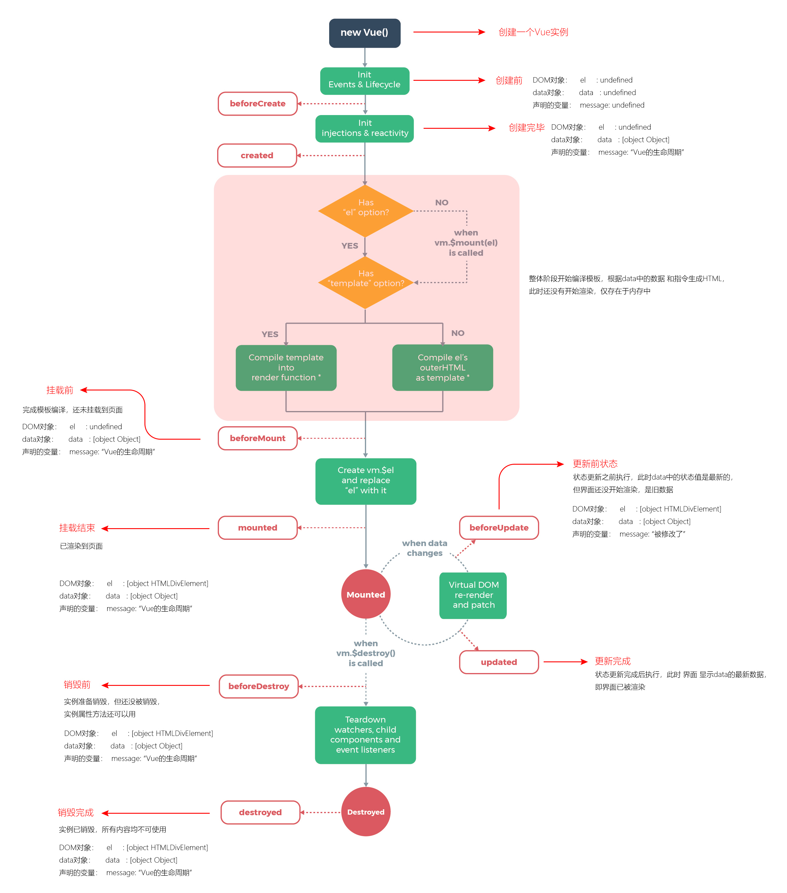

注意：watch只有数据发生改变才会执行，而created()阶段在数据实例化之前，此时改变 data() 中的数据是不会触发 change 事件的，无法进入 watch 代码部分，但是mounted()阶段在数据实例化之后，此时改变 data 中的数据是会触发 change 事件的，也就能被 watch 到。

### 23.3 v-slot插槽

1、匿名插槽 - 没有指定，全部显示

以下例子，在渲染中slot就会被替换成父组件中的插槽内容hello，注意子组件中几个slot就显示几个插槽内容：

```vue
<!--父组件.vue-->
<child>hello</child>
<!--子组件.vue-->
<template>
	<div>
    	<slot></slot>
    	<slot></slot>
  </div>
</template>
```

2、具名插槽 - 指定名称显示

以下例子，在渲染中slot就会被替换成父组件中的对应name的插槽内容：

```vue
<!--父组件.vue-->
<child>
  <template v-slot:header>
			header
  </template>
  <template v-slot:main>
			main
  </template>
</child>
<!--子组件.vue-->
<template>
	<div>
    	<slot name='header'></slot>
    	<slot name='main'></slot>
  </div>
</template>
```

3、作用域插槽 - 数据绑定，父子组件通信（组件化中常用）

下面例子，父组件通过绑定插槽 prop - slotProps来获取把绑定在slot上的属性，从而实现父组件获取子组件的值的目的，注意如果是具名插槽，下面的v-slot:default需要改成v-slot:对应的插槽名：

子组件的name属性与父组件中使用的`v-slot:name`的name对应，而子组件中的属性在父组件中通过`v-slot:name`设置的值来访问：

```vue
<!--父组件.vue-->
<current-user>
  <template v-slot:slotName="slotProps">
    {{ slotProps.user.firstName }}
  </template>
</current-user>
<!--子组件.vue-->
<span>
  <slot v-bind:user="myUser" :name='slotName'>
    {{ myUser.lastName }}
  </slot>
</span>
```

具体详见[User模块](./src/views/User/index.vue)和[table组件 - index.vue](./src/components/table/index.vue)

### 23.4 组件业务逻辑拆分

具体详见[table组件 - index.vue](./src/components/table/index.vue)和[tableLoadData.js](./src/components/table/tableLoadData.js)

2.0中使用**mixin**：

> 混入 (mixin) 是一种分发 Vue 组件中**可复用功能**的非常灵活的方式。混入对象可以包含任意组件选项。当组件使用混入对象时，所有混入对象的选项将被混入该组件本身的选项。mixin可以简单理解成常见函数封装，想像一下封装JS方法。

```js
// 定义一个混入对象.js
var myMixin = {
    created: function () {
        this.hello()
    },
    methods: {
        hello: function () {
            console.log('hello from mixin!')
        }
    }
}

// 定义一个使用混入对象的组件
var Component = Vue.extend({
    mixins: [myMixin]
})
```

**选项合并**

1、混入的 data 中，键名相同，则读取**组件**中的 键名；反之读取混入键名；

2、钩子：同名钩子函数将混合为一个数组，因此都将被调用。混入对象的钩子将在组件自身钩子**之前调用**。

3、值为对象的混入：如methods,components等，选项会被合并，**组件对象**覆盖混入对象。

## 第24课时

### 24.1 JSON对象拷贝

**1、深拷贝（白话文理解）** -  JSON.stringify(对象)；

> 直接复制原始对象所有数据，并脱离原始对象；不会对原始对象造成影响；注：深拷贝出来的对象是 **字符串类型**。

**2、浅拷贝（白话文理解）** - Object.assign({}, 对象)；

> 只复制原始对象的第一层数据，第二层及以下数据还是原始数据对象的引用；注：浅拷贝出来的对象是 **对象类型**

**3、递归方式（白话文理解）视频中没讲到**

> 把对象循环遍历一次，无论层级多深，将所以key对象全部赋给新对象，并脱离原始对象；不会对原始对象造成影响；此方法可以有效解决 深拷贝 的function、undefined、Symbol() 丢失问题；注：遍历出来的对象是什么样的就是什么样，保持不变

### 24.2 组件通讯（重要）

**组件关系：**

- 父子组件：A与B、B与C、B与D、C与E、D与E

- 子孙组件：A与D、B与E

- 兄弟组件：C与D

- 隔代组件：A与E

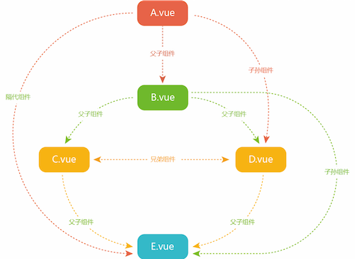

方法1：父、子组件通讯 props、emit、.sync

```vue
// 下面的“属性名”和“方法名”要一一对应
// 父组件.vue
<template>
    <B :属性名.sync="myData“ @方法名=“myFunc” />
</template>
<script>
  import {reactive} from '@vue/composition-api'
  export default {
    setup(props) {
      const myData = reactive({})
      myFunc = (number) => {}
      return {myData, myFunc}
    }
}
</script>

// 子组件.vue
<template>
    <div>{{ data }}</div>
</template>
<script>
export default {
    props: {
        属性名: {
            type: String,
            default: ""
        }
    },
    setup(){
        emit(“方法名”, 100) // 回调父组件的方法
        emit(“update:属性名”, 111111)
    }
}
</script>
```

方法2：中央事件总线 - 各级组件之间均可通讯

```js
// bus.js - 创建实例
import Vue from 'vue';
export default new Vue();

// 调用事件
import Bus from 'bus.js'
Bus.$emit('getTarget', 'hello world!');

// 注册事件
import Bus from 'bus.js'
Bus.$on('getTarget', target => {  
    console.log(target);  
}); 
```

方法3：Vuex

> 略，详见vuex部分。

方法4：$attrs、$listeners

- $attrs从外层组件传到内部组件

> 举例：A组件嵌套B，B组件嵌套C；A传递属性到B，B可以通过this.$attrs获取，并且要继续传递给下一层，就需要在下一层组件上绑定`v-on='$attrs'`，注意如果B中通过props接收相同名称的属性， this.$attrs此时以及后续都不能读取到该名称属性。$listeners传递方法同理。

方法5：provide、inject - 跨级组件间的通信

```js
// 祖先组件中通过provider来提供变量，然后在子孙组件中通过inject来注入变量
// 父组件
provide("customVal", "我是父组件向子组件传递的值");
// 子组件
inject("customVal"); // 通过this.customVal获取
```

方法6：$parent、$children

> 略，感觉较少用。

## 第25课时

### 25.1 动态路由

> 路由文件中可以设置默认路由(任何角色都能访问)和动态路由(按角色分配访问权限)，在路由守卫中判断用户角色并且动态分配路由权限。具体详见[guard.js](./src/router/guard.js)。

### 25.2 自定义指令

实现不同权限显示按钮的需求，除了可以通过[全局方法](#201 全局方法)（也就是通过注册全局方法，在按钮中v-if调用该方法并传入参数来判断是否显示），还可以是使用自定义指令的方法来实现。

**自定义指令5种状态**（操作DOM元素）

- bind：只调用一次，指令第一次绑定到元素时候调用，用这个钩子可以定义一个绑定时执行一次的初始化动作。
- Inserted：被绑定的元素插入父节点的时候调用(父节点存在即可调用，不必存在document中)
- Update：被绑定与元素所在模板更新时调用，而且无论绑定值是否有变化，通过比较更新前后的绑定值，忽略不必要的模板更新
- componentUpdate：被绑定的元素所在模板完成一次更新周期的时候调用
- Unbind：只调用一次，指令元素解绑的时候调用

```js
// 通过v-hello使用即可
Vue.directive("hello",{
  bind:function(el,bingind,vnode){
      el.style["color"] = bingind.value;
      console.log("1-bind");
  },
  inserted:function(){
      console.log("2-insert");
  },
  update:function(){
      console.log("3-update");
  },
  componentUpdated:function(){
      console.log('4 - componentUpdated');
  },
  unbind:function(){
      console.log('5 - unbind');
  }
})
```

注意自定义指令不要忘记在main.js中引入。

## 第26课时

### 26.1 keep-alive组件缓存

>vue内置组件，能在组件切换过程中保留内存中DOM元素，防止重复渲染DOM，提高性能。

原本路由：

```vue
<router-view></router-view>
```

增加缓存的写法：

```vue
<keep-alive> 
     <!--需要缓存的-->
    <router-view v-if="$route.meta.keepAlive"></router-view> 
</keep-alive> 
<!--不需要缓存的-->
<router-view v-if="!$route.meta.keepAlive"></router-view>
```

**属性：**

- include：字符串或正则表达式，只有名称匹配的组件会被缓存
- exclude：字符串或正则表达式，名称匹配的组件不会被缓存
- max：数字，最多可以缓存多少组件实例

**keep-alive相关钩子函数activated**

activated在被 keep-alive 缓存的组件激活时调用，而deactivated函数被 keep-alive 缓存的组件停用时调用。生命周期的顺序：created-mouted-activated.

### 26.2 404页面

在默认路由中添加如下配置，*指代其他为匹配到的路径，都重定向至404，注意一般404配置放到最后：

```js
[{
    path: '/404',
    name: 'page404',
    hidden: true,
    component: layout,
    children: [
        {
            path: '/404',
            component: () => import('../views/404')
        }
    ]
},
{
    path: '*',
    redirect: '404',
    hidden: true
}]
```

如果使用动态路由的话，需要将*匹配放至动态路由匹配中，然后再动态分配的时候放到最后一项。

## 第27课时

暂无。

## 第28课时

具体操作详见视频教程：[教程-1](https://www.bilibili.com/video/BV1pT4y157cv)  [教程-2](https://www.bilibili.com/video/BV1BK4y1C7a5)  [教程-3](https://www.bilibili.com/video/BV11C4y147PF)

### 28.1 服务器

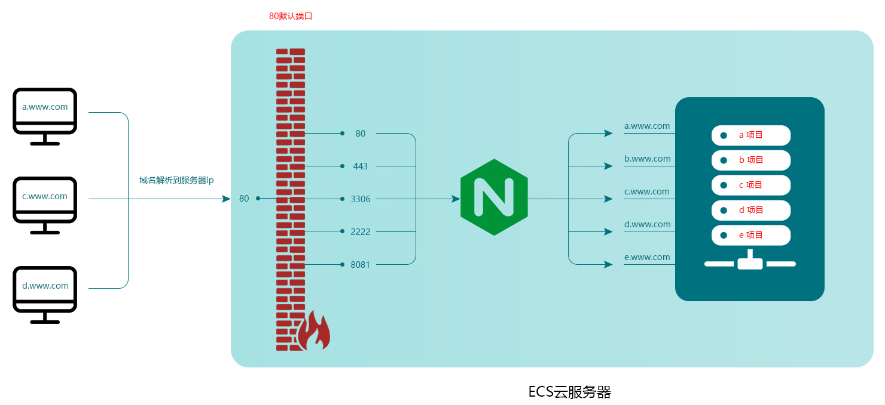

### 28.2 Nginx安装

1. 连接并进入服务器

```shell
$ssh root@服务器地址
```

2. nginx安装

```shell
// 安装：
$yum install nginx
// 卸载
$yum remove nginx
// 查看是否安装成功
$nginx –v
// 查看文件位置
$nginx –t
// 指定配置文件 - 后续的配置操作将围绕其展开
$nginx –c 目录
// 停止
$nginx -s stop
// 退出
$nginx -s quit
// 重启加载配置
$nginx -s reload
```

### 28.3 CentOS7 防火墙

**基本操作：**

启动：systemctl start firewalld.service

停止：systemctl stop firewalld.service

重启： systemctl restart firewalld.service || firewall-cmd –reload

开启开机启动： systemctl enable firewalld

禁止开机启动：systemctl disable firewalld

查看防火墙状态：firewall-cmd --state

**端口操作：**

查看已开放的端口： firewall-cmd --list-ports

开启端口： firewall-cmd --zone=public --add-port=80/tcp --permanent

关闭端口： firewall-cmd --zone=public --remove-port=3338/tcp --permanent

查询某端口是否开启： firewall-cmd --query-port=80/tcp

重启防火墙： firewall-cmd --reload

### 28.4 iptables配置

注意：CentOS 7中默认是firewalld防火墙，如果使用iptables需要先关闭firewalld防火墙（1.关闭防火墙，2.取消开机启动）。

> #关闭防火墙 systemctl stop firewalld 
>
> #取消开机启动 systemctl disable firewalld 
>
> #查看状态 firewall-cmd --state

**安装iptables：**

检查是否安装了：service iptables status

安装iptables：yum install -y iptables

安装iptables-services：yum -y install iptables-services

注册iptables服务：systemctl enable iptables.service

开启服务：systemctl start iptables.service

查看状态：systemctl status iptables.service

**Iptables配置：**

\#配置filter表

\### 允许 已连接的数据包 进入

\### 允许 新建连接的 22 80 443 端口的 tcp 包 进入

iptables -A INPUT -p tcp -m state --state NEW -m tcp --dport 22 -j ACCEPT

iptables -A INPUT -p tcp -m state --state NEW -m tcp --dport 80 -j ACCEPT

iptables -A INPUT -p tcp -m state --state NEW -m tcp --dport 443 -j ACCEPT

### 28.5 nginx配置

**proxy_pass**

- proxy_pass配置中url末尾有/时，nginx转发会将原url去除loc带/时ation匹配表达式 后的内容拼接在proxy_pass中url之后。
- proxy_pass配置中url末尾不带/时，如url中不包含path，则直接将原url拼接在proxy_pass中url之后；如url中包含path，则将原uri去除location匹配表达式后的内容拼接在proxy_pass中的url之后。

```js
// 举例 - 测试地址：http://www.web-jshtml.cn/productapi/getSms/


// 1、配置中url末尾有/时
// 代理后实际访问地址：http://www.web-jshtml.cn/api/getSms/;
location ^~ /productapi/ {
    proxy_pass http://www.web-jshtml.cn/api/;
}
// 代理后实际访问地址：http://www.web-jshtml.cn/getSms/;
location ^~ /productapi/ {
    proxy_pass http://www.web-jshtml.cn/;
}
// 代理后实际访问地址：http://www.web-jshtml.cn//getSms/;
location ^~ /productapi {
    proxy_pass http://www.web-jshtml.cn/;
}
// 代理后实际访问地址：http://www.web-jshtml.cn/api//getSms/;
location ^~ /productapi {
    proxy_pass http://www.web-jshtml.cn/api/;
}

// 2、配置中url末尾无/时 
// 代理后实际访问地址：http://www.web-jshtml.cn/productapigetSms/;
location ^~ /productapi/ {
    proxy_pass http://www.web-jshtml.cn/productapi;
}
// 代理后实际访问地址：http://www.web-jshtml.cn/api/getSms/;
location ^~ /productapi {
    proxy_pass http://www.web-jshtml.cn/api;
}
// 代理后实际访问地址：http://www.web-jshtml.cn/productapi/getSms/;
location ^~ /productapi/ {
    proxy_pass http://www.web-jshtml.cn;
}
// 代理后实际访问地址：http://www.web-jshtml.cn/productapi/getSms/;
location ^~ /productapi {
    proxy_pass http://www.web-jshtml.cn;
}
```

**location匹配规则**

| **标识符** | **描述**                                                     |
| ---------- | ------------------------------------------------------------ |
| =          | **精确匹配**；用于标准url前，请求字符串和url严格匹配。如果匹配成功，就停止匹配，立即执行该location里面的请求。 |
| ~          | **正则匹配**；用于正则url前，表示uri里面包含正则，并且区分大小写。 |
| ~*         | **正则匹配**；用于正则url前，表示uri里面包含正则，不区分大小写。 |
| ^~         | **非正则匹配**；用于标准url前，nginx服务器匹配到前缀最多的uri后就结束，该模式匹配成功后，不会使用正则匹配。 |
| 无         | **普通匹配（最长字符匹配）**；与location顺序无关，是按照匹配的长短来取匹配结果。若完全匹配，就停止匹配。 |

>**优先级** - 多个location配置的情况匹配顺序为：首先精确匹配 = ；其次前缀匹配 ^~；其次是按照配置文件中的正则匹配；然后匹配不带任何修饰符的前缀匹配；最后交给/通用匹配；

```js
// 举例
location = / {  
   //精确匹配/ ，主机名后面不能带任何字符串
    echo "规则A";
}
location = /login {
  //精确匹配 /login 开头的地址，匹配符合以后，不在继续往下搜索 
    echo "规则B";
}
location ^~ /blog/ { 
  //非正则匹配，匹配/blog/后，停止往下搜索正则，采用这一条
  echo "规则C";
}
location ~  \.(gif|jpg|png|js|css)$ {
    //区分大小写的正则匹配  若匹配成功，停止往下搜索正则，采用这一条
    echo "规则D";
}
location ~* \.png$ {  
   //区分大小写的正则匹配 ，停止往下搜索正则，采用这一条
    echo "规则E";
}
location / {
  //因为所有的地址都以 / 开头，所以这条规则将匹配到所有请求
  //如果没任何规则匹配上，就采用这条规则
    echo "规则F";
}
location /blog/detail { 
  //最长字符串匹配，若完全匹配成功，就不在继续匹配，否则还会进行正则匹配
  echo "规则G";
}
location /images {  
    //最长字符串匹配，同上 
    echo "规则Y";
}
location ^~ /static/files {  
    //非正则匹配，若匹配成功，就不在继续匹配
    echo "规则X";
}

// 当访问根路径/的时候，比如http://www.web-jshtml.cn/ ，会匹配规则A。
// 当访如http://www.web-jshtml.c/login ，会匹配规则B。
// 当访如http://www.web-jshtml.c/login.html ，会匹配规则F。
// 当访如http://www.web-jshtml.c/blog/detail/3.html ，会匹配规则C。 - 按匹配优先级去找
```

**rewrite 重定向**

指令语法：`rewrite regex replacement [flag];`

| 字符      | 描述                                                         |
| --------- | ------------------------------------------------------------ |
| \         | 将后面接着的字符标记为一个特殊字符或者一个原义字符或一个向后引用 |
| ^         | 匹配输入字符串的起始位置                                     |
| $         | 匹配输入字符串的结束位置                                     |
| *         | 匹配前面的字符零次或者多次                                   |
| +         | 匹配前面字符串一次或者多次                                   |
| ?         | 匹配前面字符串的零次或者一次                                 |
| .         | 匹配除“\n”之外的所有单个字符                                 |
| (pattern) | 匹配括号内的pattern                                          |

rewrite最后一项flag参数：

| 标记符号  | 说明                                               |
| --------- | -------------------------------------------------- |
| last      | 本条规则匹配完成后继续向下匹配新的location URI规则 |
| break     | 本条规则匹配完成后终止，不在匹配任何规则           |
| redirect  | 返回302临时重定向                                  |
| permanent | 返回301永久重定向                                  |

```js
// 举例：
// 表示匹配成功后跳转，执行永久301跳转
rewrite ^/(.*) http://www.web-jshtml.cn/ permanent;    
```

## 第29课时 

### 29.1 总结

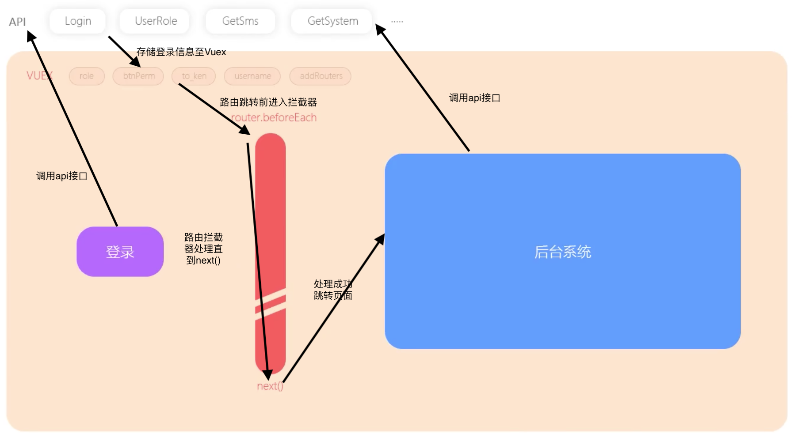

### 29.2 Vue2.0重置

基础模版（方法使用this.XXX; 数据使用this.XXX）：

```js
export default {
    name: "vue2.0_example",
  	components: {},
  	props: {}, // 其他地方使用props直接通过this.XXX即可
    data() {
        return {
            myData: 0
        }
    },
  	computed: {
      myData(){
        return XXX;
      }
    },
  	watch:{
    	a(val, oldVal){ // 普通的watch监听
         console.log("a: "+val, oldVal);
     	},
     	b:{ // 深度监听，可监听到对象、数组的变化
         handler(val, oldVal){
             console.log("b.c: "+val.c, oldVal.c);
         },
         deep:true // true 深度监听，
         immediate: true // 初始化监听
     	}
    },
    beforeCreate() {},
    created() {},
    beforeMount() {},
    mounted() {},
    beforeUpdate() {},
    updated() {},
    beforeDestroy() {},
    destroyed() {},
    methods: {
        myFunc() {}
    },
}
```

## 其他

### 1. 日报、周报总结

> 建议养成写日报的习惯，这样写周报就比较容易。

- 周报内容：

  1、........
  2、........
  3、........

- 总结周报：

  1、这周做了什么？
  2、在项目上体现出来的业绩？
  3、开发中遇到的问题以及解决方法和思路？
  
  - 技术难点：如何攻克这些难点？
  - 业务沟通：业务的想法，建议性东西
  - 项目想法：项目上的自己的见解想法、建设性建议等

### 2. 项目管理

git仓库不同分支可记录进行管理：

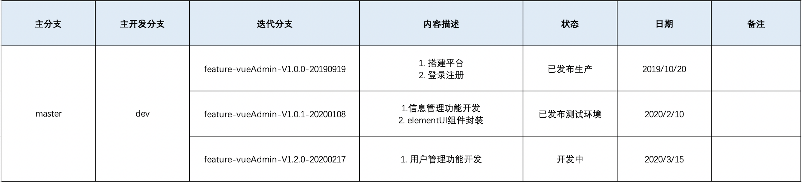


## 课时总结

- 第1学时 了解产品从0到1的开发流程，产品经理、UI设计师、研发部、测试工程师
- 第2学时 安装node.js、vue3.0脚手架、创建github代码管理仓库、构建vue项目
- 第3学时 2.0与3.0的差异，vue.config.js、引入全局样式、router重定向、elementui依赖，git命令提交文件
- 第4学时 vue文件标准结构、v-for遍历、key、v-bind属性、@click事件、绑定class、基础数据类型、引用数据类型区别
- 第5学时 熟悉element-ui组件、制作表单验证、了解组件的用法
- 第6学时 封装校验js文件、webpack目录配置指向、export暴露方法、import引用、指令v-show、v-if的区别
- 第7学时 2.0语法转3.0、setup函数、reactive函数、ref函数、isRef、toRefs方法
- 第8学时 axios拦截器，模块管理API，export、export default的区别
- 第9学时 axios跨域配置、环境变量、接口文档
- 第10学时 登录接口接调试、响应拦截、elementui message、root参数
- 第10-1学时 登录接口接调试、响应拦截、elementui message、root参数
- 第11学时 按测试用例流程开发项目、注册接口联调、倒计时setTimeout、setInterval、超时timeout、登录接口调试、定时器知识点
- 第12学时 了解基础的Promise的方法、resolve、reject、all、race、then、catch
- 第13学时 请求头拦截、Request Headers添加参数、登录密码sha1加密、前端台加密流程、代码优化封装方法
- 第14学时 简单了解vue学习目标，具体学习什么东西，了解基础的指令
- 第15学时 后台首页搭建、router路由跳转、children属性、components组件、局部组件引入
- 第16学时 elementui的el-menu组件生成路由菜单、定义全局elemenui样式表、修改组个样式
- 第17学时 svgIcon制作、全局组件Vue.component、父子组件传值props、propsData、计算属性computed
- 第18学时 Vuex、State、Getters、Mutations、菜单导航收起、展开
- 第18-1学时 cookie存储，sessionStorage存储、localStorage存储、JSON.parse、JSON.stringify
- 第18-2学时 Vuex的action异步、同步、modules模块管理状态数据
- 第19学时 router.beforeEach路由守卫，检测toKen是否非法进入后台，to、from参数、next方法、Vuex命名空间
- 第19-1学时 登录存储token、token存在基础逻辑进入后台
- 第19-2学时 退出后台清除token、防止非法进入、GIT代码合并、提交当天开发的代码
- 第20学时 设计稿UI制作、element-ui组件、el-select、el-row、el-col、el-button
- 第20-1学时 设计稿UI制作、element-ui组件、el-table、el-pagination
- 第20-2学时 设计稿UI制作、element-ui组件、el-dialog、父子组件回调emit、修饰器sync、vue2.0、3.0写法、watch
- 第20-3学时 设计稿UI制作、element-ui组件、el-messageBox、自定义全局方法export install、VUE3.0组件重命名、watch
- 第20-4学时 设计稿UI制作、信息分类UI制作
- 第21学时 信息管理模块，一级分类接口、获取分类接口、onMounted、相关优化
- 第21-1学时 信息管理模块，删除接口、修改接口
- 第21-2学时 接口封装，vue3.0封装方式，vuex的actions方式，为后期维护方便
- 第21-3学时 添加信息接口、获取列表接口、分页处理请求数据、获取分类优化，变量优化
- 第21-4学时 单记录、批量删除接口、table组件数据加载优化、formatter属性返回值、日期组件配置数据格式、筛选条件处理
- 第21-5学时 信息编辑接口、添加子级分类接口、请求全部分类接口
- 第21-6学时 原型学习、原型版本查看、GIT命令控制代码版本迭代、合并代码、创建新分支

- 第22学时 router路由跳转、5种传参方式、vuex配合HTML5本地储存
- 第22-1学时 详细页数据读取、初始化数据、富文本编辑器、vue devTool依赖
- 第22-2学时 elementui upload组件结合七牛云第三方储存，七牛云建立空间、域名绑定、解析
- 第22-3学时 elementUI组件二次封装开发，组件封装的一些问题思考，什么时候需要watch，传参动态配置数据

- 第23学时 用户管理功能迭代、git分支创建、日常工作中的日报、周报总结、项目的管理

- 第23-1学时 用户管理UI制作、elementUI el-select组件封装、参数配置、组件命名冲突
- 第23-2学时 真正理解vue组件化开发、组件概念、优势、全局组件component、局部组件import、从源头解决BUG
- 第23-3学时 vue生命周期，组件生命周期，3.0改写2.0组件
- 第23-4学时 vue3.0生命周期，封装el-table组件
- 第23-5学时 封装el-table组件，v-slot插槽3种方式，数据绑定
- 第23-6学时 封装el-table组件，数据请求，整合url请求地址，统一api文件夹管理
- 第23-7学时 封装el-table组件，业务逻辑的拆分、组合
- 第23-8学时 elementUI 页码组件、业务逻辑拆分页码，配置项
- 第23-9学时 vue2.0 mixins混入、按需混入、全局混入

- 第24学时 省、市、区、街道组件封装、业务逻辑抽离
- 第24-1学时 省、市、区、街道组件封装、业务逻辑抽离
- 第24-2学时 省市区数据返回，el-radio、el-checkbox、获取角色管理API
- 第24-3学时 用户添加接口、json对象深拷贝、浅拷贝用法及注意事项
- 第24-4学时 组件通讯开始篇.sync、elemntUI Switch组件、用户列表、删除接口联调
- 第24-5学时 组件通讯完整版（重点知识）
- 第24-6学时 用户状态接口、编辑接口、搜索接口联调（上）
- 第24-7学时 用户状态接口、编辑接口、搜索接口联调（下）

- 第25学时 动态路由开发，以系统分配路由，系统列表接口
- 第25-1学时 动态路由开发，以角色分配路由
- 第25-2学时 按钮级权限
- 第25-3学时 按钮级权限，自定义指令处理

- 第26学时 组件缓存keep-alive、接口优化避免资源浪费
- 第26-1学时 BUG修复、监听路由变化、环境变量参数配置
- 第26-2学时 404页面
- 第26-3学时 404页面问题修复，退出接口联调

- 第27学时 BUG修复过程、优先级排序、项目流程阶段

- 第28学时 ECS云服务器购买、了解服务器的基础结构、nginx安装、端口配置、防火墙
- 第28-1学时 nginx配置、多项目部署、单项目部署、iptables安装配置
- 第28-2学时 nginx配置、日志查看，proxy_pass指向配置、调通接口数据、域名解析访问项目


------

如果发现本项目有错误，欢迎提交 issues 指正。